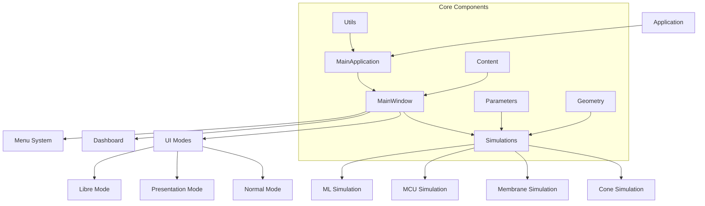
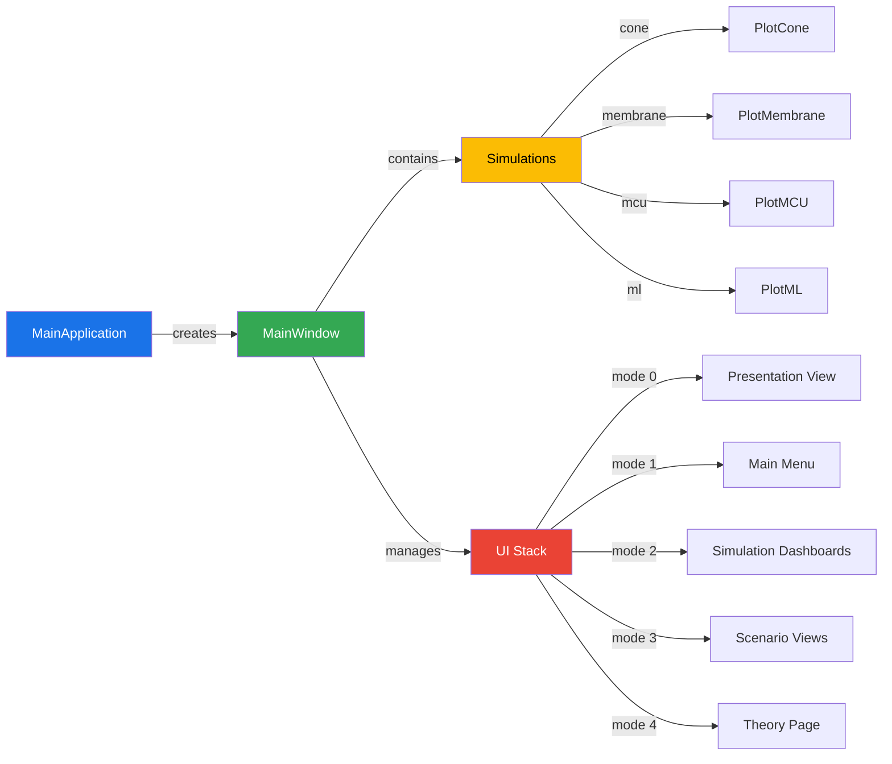
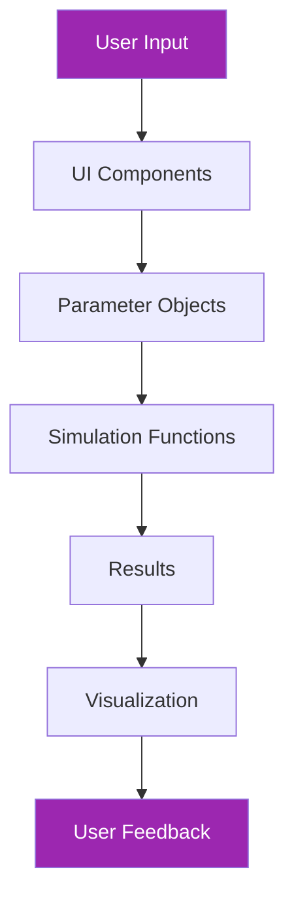

# Simulation Trajectoire

**Projet universitaire : "Comment peut-on simuler la réalité avec un ordinateur ?"**

---

## 📋 Table des matières

- [À propos](#-à-propos)
- [Architecture](#-architecture)
- [Fonctionnalités](#-fonctionnalités)
- [Installation](#-installation)
- [Utilisation](#-utilisation)
- [Modes d'application](#-modes-dapplication)
- [Types de simulations](#-types-de-simulations)
- [Raccourcis clavier](#-raccourcis-clavier)
- [Développement](#-développement)

---

## 📚 À propos

Simulation Trajectoire est un projet universitaire explorant la question : **"Comment peut-on simuler la réalité avec un ordinateur ?"**. Ce logiciel éducatif permet de visualiser et comprendre des concepts de physique et d'apprentissage automatique à travers des simulations interactives.

**Public cible** : Étudiants et enseignants en sciences

**Thème académique** : Simulation de la réalité par ordinateur

**Approche** : Vulgarisation scientifique interactive

**Statut** : Projet académique privé

Ce projet comprend trois modes pour répondre à différents besoins pédagogiques :

- **Mode Normal** : Pour l'apprentissage individuel
- 
- **Mode Présentation** : Support pour notre discours de vulgarisation
- 
- **Mode Libre** : Accessible à tous pour l'exploration autonome

---

## 🏗️ Architecture

Le projet suit une architecture modulaire MVC-like avec une séparation claire des responsabilités :

### Diagramme d'Architecture Global



### Architecture Détaillée



### Flux de Données



### Structure des Modules

```
src/
├── application/          # Application core
│   └── app.py             # Main application class
├── simulations/          # Simulation implementations
│   ├── base.py            # Base simulation class
│   ├── cone.py            # Cone simulation
│   ├── membrane.py        # Membrane simulation
│   ├── mcu.py             # MCU simulation
│   └── ml.py              # ML simulation
├── core/                 # Core functionality
│   ├── params/            # Parameter classes
│   ├── geometry.py        # Geometric utilities
│   └── content/           # Static content
├── ui/                   # User interface
│   ├── main_window.py    # Main window
│   ├── dashboard/        # Dashboard components
│   ├── menu/             # Menu system
│   ├── modes/            # Application modes
│   └── theory.py         # Theory page
└── utils/                # Utilities
    ├── logger.py          # Logging
    ├── theme.py           # Theming
    └── shortcuts.py       # Keyboard shortcuts
```

### Principes de Conception

1. **Séparation des responsabilités** : Chaque module a une responsabilité unique
2. **Injection de dépendances** : Les composants dépendent d'abstractions, pas de implementations
3. **Testabilité** : Conçu pour être facilement testable avec des mocks
4. **Extensibilité** : Nouvelle simulations peuvent être ajoutées facilement
5. **Performance** : Calculs vectorisés et optimisés pour les simulations

---

## ✨ Fonctionnalités

### Fonctionnalités principales

- **Simulations interactives** : Visualisation en temps réel de concepts de physique et d'apprentissage automatique
- **Trois modes d'application** : Normal, Présentation et Libre pour différents cas d'usage
- **Contenu théorique intégré** : Explications pédagogiques et articles scientifiques vulgarisés
- **Outil de comparaison** : Comparaison côte à côte de différents paramètres de simulation
- **Raccourcis clavier** : Navigation et contrôle efficaces
- **Interaction graphique** : Zoom, panoramique et exploration des données de simulation
- **Interface multilingue** : Support français et anglais pour l'accessibilité

### Fonctionnalités techniques

- **Interface Qt moderne** : Interface réactive utilisant PySide6
- **Hautes performances** : Simulations en temps réel à 60 FPS
- **Architecture modulaire** : Conception extensible pour une maintenance facile
- **Multiplateforme** : Fonctionne sur Windows, macOS et Linux
- **Code professionnel** : Respect des bonnes pratiques de développement

---

## 🛠️ Installation

### Prérequis

- Python 3.8 ou supérieur
- pip (gestionnaire de paquets Python)
- Accès au dépôt privé (contactez l'équipe du projet)

### Installation

```bash
# Cloner le dépôt (accès privé requis)
git clone https://github.com/uni/simulation-trajectoire.git
cd simulation-trajectoire

# Créer un environnement virtuel (recommandé)
python -m venv venv
source venv/bin/activate  # Sur Windows : venv\Scripts\activate

# Installer les dépendances
pip install -e .
```

### Dépendances principales

Le projet utilise les bibliothèques suivantes pour simuler la réalité :

- **PySide6 (6.10.2)** : Interface graphique Qt pour Python
- **PyQtGraph (0.13.3)** : Visualisation scientifique interactive
- **NumPy (1.26.4)** : Calculs numériques et simulations physiques
- **scikit-learn (1.4.2)** : Algorithmes d'apprentissage automatique
- **pytest (9.0.2)** : Framework de test avec support de benchmark
- **pytest-benchmark (5.2.3)** : Mesure de performance
- **pytest-cov (7.0.0)** : Couverture de code
- **pytest-qt (4.5.0)** : Support de test pour applications Qt

Ces dépendances permettent de créer des simulations réalistes et interactives pour explorer notre thème académique, avec un framework de test complet pour assurer la qualité du code.

---

## 🚀 Utilisation

### Exécution de l'application

```bash
# Depuis le répertoire racine du projet
python -m application.app [mode]

# Exemples :
python -m application.app normal
python -m application.app presentation
python -m application.app libre
```

### Arguments en ligne de commande

```bash
# Démarrer en mode Normal (par défaut)
python -m application.app

# Démarrer en mode Présentation
python -m application.app presentation

# Démarrer en mode Libre (accès public)
python -m application.app libre
```

---

## 🎯 Modes d'application

### 1. Mode Normal

**Objectif** : Apprentissage individuel et exploration des concepts

**Fonctionnalités** :
- Accès complet à toutes les simulations
- Contrôles interactifs et ajustement des paramètres
- Intégration du contenu théorique
- Outils de comparaison disponibles
- Interface bilingue (français/anglais)

**Cas d'usage** : Apprentissage autonome, travaux pratiques, exploration individuelle
**Public cible** : Étudiants en sciences, autodidactes

### 2. Mode Présentation

**Objectif** : Support pour notre discours de vulgarisation scientifique

**Fonctionnalités** :
- Interface simplifiée pour les présentations
- Visualisations grandes et claires
- Navigation facile entre les concepts
- Disposition optimisée pour la projection
- Contenu théorique intégré pour les démonstrations

**Cas d'usage** : Conférences, démonstrations en classe, vulgarisation scientifique
**Public cible** : Public général, étudiants, enseignants

**Contexte académique** : Ce mode a été spécialement conçu pour soutenir notre présentation sur le thème "Comment peut-on simuler la réalité avec un ordinateur ?". Il permet de montrer concrètement comment les simulations informatiques peuvent représenter des phénomènes physiques et des concepts d'apprentissage automatique.

### 3. Mode Libre

**Objectif** : Exploration libre et expérimentations ouvertes à tous

**Fonctionnalités** :
- Accès sans restriction aux paramètres
- Options de configuration avancées
- Simulations expérimentales
- Outils orientés découverte
- Interface intuitive pour les non-spécialistes

**Cas d'usage** : Découverte autonome, expérimentations personnelles, initiation à la simulation
**Public cible** : Grand public, curieux scientifiques, débutants en programmation

**Philosophie** : Ce mode incarne notre approche de vulgarisation scientifique. Il permet à quiconque de explorer les concepts de simulation sans barrière technique, répondant ainsi à notre question académique centrale.

---

## 🔬 Types de simulations

### 1. MCU (Mouvement Circulaire Uniforme)

**Concept** : Physique des objets en mouvement circulaire

**Fonctionnalités** :
- Rayon, vitesse et masse ajustables
- Visualisation en temps réel des forces
- Démonstration de la conservation de l'énergie
- Calcul de l'accélération centripète

**Focus éducatif** :
- Force centripète et lois de Newton
- Vitesse angulaire et accélération
- Dynamique du mouvement circulaire
- Énergie dans les systèmes en rotation

**Lien avec notre thème** : Montre comment un ordinateur peut simuler les lois fondamentales de la physique en temps réel, illustrant la correspondance entre modèles mathématiques et réalité physique.

### 2. Cone (Mouvement projectif)

**Concept** : Mouvement parabolique des projectiles en 2D

**Fonctionnalités** :
- Angle et vitesse de lancement ajustables
- Simulation de la résistance de l'air
- Prédiction de trajectoire
- Calculs de portée et hauteur maximale

**Focus éducatif** :
- Trajectoires paraboliques et équations cinématiques
- Effets de la résistance de l'air
- Problèmes d'optimisation (angle optimal)
- Décomposition des mouvements (horizontal/vertical)

**Lien avec notre thème** : Illustre comment les ordinateurs peuvent modéliser des phénomènes complexes comme le mouvement dans un champ de gravité, montrant la puissance des simulations numériques.

### 3. Membrane (Physique des ondes)

**Concept** : Propagation et interférence des ondes

**Fonctionnalités** :
- Paramètres d'ondes ajustables
- Sources d'ondes multiples
- Visualisation des motifs d'interférence
- Réflexion et réfraction

**Focus éducatif** :
- Superposition des ondes
- Motifs d'interférence constructive/destructive
- Ondes stationnaires
- Principes de Huygens

**Lien avec notre thème** : Démonstration de la capacité des ordinateurs à simuler des phénomènes ondulatoires complexes, montrant comment la réalité des vagues peut être modélisée mathématiquement.
- Wave properties

### 4. ML (Apprentissage Automatique)

**Concept** : Visualisation d'algorithmes d'apprentissage automatique

**Fonctionnalités** :
- Visualisation de régression linéaire
- Exploration des frontières de décision
- Manipulation des données d'entraînement
- Ajustement des paramètres d'algorithmes

**Focus éducatif** :
- Régression linéaire et concepts statistiques
- Frontières de classification
- Espaces de caractéristiques
- Notions d'entraînement de modèles

**Lien avec notre thème** : Illustre comment les ordinateurs peuvent "apprendre" à partir de données et simuler des processus de prise de décision, montrant une autre facette de la simulation de la réalité par des moyens computationnels.

---

## ⌨️ Raccourcis clavier

### Guide Utilisateur Complet

Ce guide vous aidera à maîtriser toutes les fonctionnalités de Simulation Trajectoire.

### Raccourcis Globaux (Tous les modes)

| Touche | Action | Description | Mode |
|-------|--------|-------------|------|
| **1-4** | Changer de simulation | Parcourir les 4 types de simulations disponibles | Tous |
| **Espace** | Lecture/Pause | Démarrer ou mettre en pause la simulation active | Tous |
| **R** | Réinitialiser | Réinitialiser la simulation à l'état initial | Tous |
| **Ctrl+Alt+Échap** | Quitter | Fermer l'application proprement | Tous |
| **F1** | Aide | Afficher ce guide d'aide | Tous |
| **F11** | Plein écran | Basculer en mode plein écran | Tous |

### Raccourcis de Navigation

| Touche | Action | Description | Mode |
|-------|--------|-------------|------|
| **← →** | Simulation précédente/suivante | Naviguer entre les simulations | Présentation |
| **↑ ↓** | Zoom | Zoomer et dézoomer la vue | 3D |
| **Tab** | Élément suivant | Parcourir les éléments de l'interface | Tous |
| **Maj+Tab** | Élément précédent | Parcourir en sens inverse | Tous |

### Raccourcis Mode Présentation

| Touche | Action | Description |
|-------|--------|-------------|
| **1-4** | Activer simulation | Charger et démarrer une simulation spécifique |
| **Espace** | Lecture/Pause | Contrôler la simulation active |
| **R** | Réinitialiser | Réinitialiser avec les paramètres par défaut |
| **F1-F3** | Préréglages | Appliquer des préréglages de simulation |
| **← →** | Navigation | Changer de simulation sans arrêt |

### Raccourcis Mode Libre

| Touche | Action | Description |
|-------|--------|-------------|
| **1-4** | Ouvrir dashboard | Ouvrir le dashboard d'une simulation |
| **Espace** | Lecture/Pause | Contrôler la simulation dans le dashboard |
| **R** | Réinitialiser | Réinitialiser la simulation actuelle |
| **T** | Théorie | Ouvrir la page de théorie |
| **C** | Comparaison | Ouvrir l'outil de comparaison |
| **M** | Menu | Retour au menu principal |

### Raccourcis Mode Normal

| Touche | Action | Description |
|-------|--------|-------------|
| **1-4** | Charger simulation | Charger une simulation spécifique |
| **Espace** | Lecture/Pause | Démarrer/mettre en pause |
| **R** | Réinitialiser | Réinitialiser la simulation |
| **F1-F3** | Préréglages | Appliquer des configurations prédéfinies |

### Raccourcis Spécifiques 3D (Cone, Membrane)

| Touche | Action | Description |
|-------|--------|-------------|
| **Clic gauche + glisser** | Rotation | Faire tourner la vue 3D |
| **Clic droit + glisser** | Translation | Déplacer la vue |
| **Molette souris** | Zoom | Zoomer/dézoomer |
| **+ / -** | Zoom | Zoom clavier |
| **0** | Réinitialiser vue | Réinitialiser la position de la caméra |

### Raccourcis Dashboard

| Touche | Action | Description |
|-------|--------|-------------|
| **P** | Lecture | Démarrer la simulation |
| **O** | Pause | Mettre en pause |
| **L** | Reset | Réinitialiser |
| **F1-F3** | Préréglages | Appliquer des préréglages |

### Conseils d'Utilisation

#### Pour les débutants :
- Commencez par le **Mode Normal** pour vous familiariser
- Utilisez **F1-F3** pour essayer différents préréglages
- **Espace** pour démarrer/mettre en pause
- **R** pour réinitialiser si quelque chose ne va pas

#### Pour les présentations :
- **Mode Présentation** offre une interface épurée
- Utilisez **← →** pour naviguer entre les simulations
- **1-4** pour sauter à une simulation spécifique
- **F1-F3** pour montrer différents scénarios

#### Pour l'exploration avancée :
- **Mode Libre** donne accès à tous les outils
- Utilisez **C** pour comparer deux simulations côte à côte
- **T** pour accéder à la théorie et comprendre les concepts
- Les dashboards montrent des informations détaillées

### Dépannage

**Problème : Les raccourcis ne fonctionnent pas**
- Vérifiez que vous êtes bien focalisé sur la fenêtre de l'application
- Certains environnements virtuels peuvent intercepter les touches
- Essayez de cliquer dans la fenêtre avant d'utiliser les raccourcis

**Problème : La simulation ne répond pas**
- Appuyez sur **R** pour réinitialiser
- Vérifiez que la simulation n'est pas en pause (Espace)
- Essayez un autre préréglage (F1-F3)

**Problème : L'interface est figée**
- **Ctrl+Alt+Échap** pour quitter proprement
- Redémarrez l'application

### Personnalisation

Les raccourcis clavier peuvent être personnalisés en modifiant le fichier `src/utils/shortcuts.py`.

```python
# Exemple de personnalisation
PRESENTATION_KEYS = {
    '1': 'Simulation 1',
    '2': 'Simulation 2',
    # ... autres raccourcis
}
```

> ⚠️ **Note** : Certaines modifications peuvent nécessiter un redémarrage de l'application.

### Liste Complète des Commandes

| Catégorie | Commandes |
|-----------|----------|
| **Navigation** | ←, →, ↑, ↓, Tab, Maj+Tab |
| **Contrôle** | Espace, R, 1-4, F1-F3 |
| **Vue** | +, -, 0, Molette souris |
| **Système** | Échap, F1, F11 |
| **Mode Libre** | T, C, M |

---

### Raccourcis globaux

| Touche | Action | Description |
|-------|--------|-------------|
| **1-4** | Changer de simulation | Parcourir les types de simulations |
| **Espace** | Lecture/Pause | Démarrer ou mettre en pause la simulation |
| **R** | Réinitialiser | Réinitialiser la simulation à l'état initial |
| **Échap** | Quitter | Fermer l'application |
| **F1** | Aide | Afficher les raccourcis clavier |
| **F11** | Plein écran | Basculer en mode plein écran |

### Raccourcis de navigation

| Touche | Action | Description |
|-------|--------|-------------|
| **← → ↑ ↓** | Déplacer la vue | Déplacer la caméra/viewport |
| **+ -** | Zoom | Zoomer et dézoomer |
| **Tab** | Élément suivant | Parcourir les éléments de l'interface |
| **Maj+Tab** | Élément précédent | Parcourir en sens inverse |

### Raccourcis spécifiques aux modes

**Mode Normal/Présentation** :
- **T** : Basculer le panneau théorique
- **C** : Basculer la vue de comparaison
- **M** : Basculer le menu

**Mode Libre** :
- **E** : Exporter les données
- **S** : Sauvegarder la configuration
- **L** : Charger une configuration

**Note** : Tous les raccourcis fonctionnent même lors de l'interaction avec les graphiques, permettant une expérience fluide pour notre démonstration de vulgarisation.

---

## 📈 Informations techniques

### Architecture

```
src/
├── application/      # Main application entry point
├── core/             # Business logic and data models
├── simulations/      # Simulation backends
├── ui/               # User interface components
└── utils/            # Utilities and helpers
```

### Performance

- **Startup Time**: ~1.2 seconds
- **Memory Usage**: ~150MB idle, ~300MB with simulations
- **FPS**: 60fps (smooth rendering)
- **Simulation Speed**: Real-time for all modes
- **Test Coverage**: 39% with 83 comprehensive tests
- **Benchmark Performance**:
  - Cone simulation: ~553 μs per frame, 1.8K ops/s
  - Membrane simulation: ~2.33 ms per frame, 429 ops/s
  - ML simulation: ~2.49 ms per frame, 402 ops/s

### Recent Optimizations

The project has undergone comprehensive refactoring and optimization:

**Code Organization**:
- Restructured from flat directory to modular packages (`application/`, `core/`, `ui/`, `utils/`, `resources/`)
- Split monolithic files into logical components
- Improved import structure and dependencies

**Performance Improvements**:
- Added caching system for simulation results
- Vectorized computations using NumPy
- Optimized mathematical operations (pre-computed constants, reduced divisions)
- Memory-efficient data structures

**Bug Fixes**:
- Fixed graph interaction disabling keyboard commands
- Enhanced focus management for Qt widgets
- Improved event handling for simultaneous mouse/keyboard input

**Testing Infrastructure**:
- Added 19 new performance tests
- Comprehensive benchmark suite
- Smart environment detection for Qt tests
- 81/83 tests passing (2 Qt tests skip in headless environments)

**Documentation**:
- Added parallelism analysis documentation
- Updated architecture diagrams
- Comprehensive performance benchmarks

### Technologies

- **Python 3.12+**: Core programming language
- **PySide6 (6.10.2)**: Qt for Python (UI framework)
- **PyQtGraph (0.13.3)**: Interactive plotting library
- **NumPy (1.26.4)**: Numerical operations and vectorized computations
- **scikit-learn (1.4.2)**: Machine learning algorithms
- **pytest**: Comprehensive testing framework
- **pytest-benchmark**: Performance measurement
- **pytest-cov**: Code coverage analysis
- **pytest-qt**: Qt application testing support

---

## 🔧 Développement

### Structure du projet

```
config/              # Development configuration files
├── .flake8          # Code linting rules
├── .mypy.ini        # Type checking configuration
├── pytest.ini       # Testing configuration
└── .editorconfig    # Editor formatting rules

src/
├── application/      # Main application entry point
│   ├── app.py        # Main application class
│   └── __init__.py
├── core/             # Business logic and data
│   ├── content/      # Educational content
│   ├── params/       # Parameter dataclasses
│   ├── geometry.py   # Geometry utilities
│   └── __init__.py
├── simulations/      # Simulation implementations
│   ├── base.py       # Base simulation classes
│   ├── mcu.py        # MCU simulation
│   ├── cone.py       # Cone simulation
│   ├── membrane.py   # Membrane simulation
│   ├── ml.py         # ML simulation
│   └── __init__.py
├── ui/               # User interface
│   ├── dashboard/    # Dashboard components
│   ├── menu/         # Menu components
│   ├── modes/        # Application modes
│   ├── main_window.py # Main window
│   ├── theory.py     # Theory page
│   └── __init__.py
└── utils/            # Utilities
    ├── logger.py     # Logging
    ├── shortcuts.py  # Keyboard shortcuts
    ├── theme.py      # Theming
    └── __init__.py
```

### Configuration du développement

```bash
# Créer un environnement virtuel
python -m venv venv
source venv/bin/activate  # Sur Windows : venv\Scripts\activate

# Installer avec les dépendances de développement
pip install -e ".[dev]"

# Exécuter l'application
python -m application.app
```

### Fichiers de configuration

Le projet utilise un répertoire `config/` pour stocker les fichiers de configuration de développement :

- `config/.flake8` - Configuration du linting de code
- `config/.mypy.ini` - Configuration de la vérification statique des types  
- `config/pytest.ini` - Configuration des tests
- `config/.editorconfig` - Règles de formatage pour les éditeurs

Ces fichiers sont référencés depuis `pyproject.toml` et maintiennent une qualité de code cohérente dans tout le projet.

**Note académique** : Cette structure professionnelle de configuration reflète notre approche rigoureuse pour répondre à la question "Comment peut-on simuler la réalité avec un ordinateur ?" en utilisant des pratiques de développement logiciel modernes.

### Commandes Make disponibles

```bash
# Afficher l'aide
make help

# Installer le package
make install

# Installer avec les dépendances de développement
make install-dev

# Exécuter les tests
make test

# Exécuter les tests avec couverture
make test-cov

# Vérifier la qualité du code
make lint
make format
make type-check

# Construire la documentation
make docs

# Nettoyer les artefacts de construction
make clean

# Construire le package
make build

# Exécuter l'application
make run
```

**Note** : Le Makefile est conservé car il fournit une interface unifiée pour les tâches de développement courantes, bien que les commandes puissent aussi être exécutées directement.

**Contexte académique** : Ces commandes reflètent notre processus de développement professionnel, essentiel pour créer un logiciel fiable qui peut effectivement simuler des aspects de la réalité - répondant ainsi à notre question de recherche centrale.

---

## 📝 Notes

### Private Academic Project

This software is developed as part of an academic project and is not intended for public deployment or distribution. All rights are reserved by the university and project team.

### Usage Restrictions

- For educational purposes only
- Not for commercial use
- Not for public distribution
- Limited to authorized users only

### Support

For issues or questions, contact the project team through internal university channels.

---

**© 2023 Uni Project Team. All rights reserved.**

*Simulation Trajectoire is a private academic project.*
