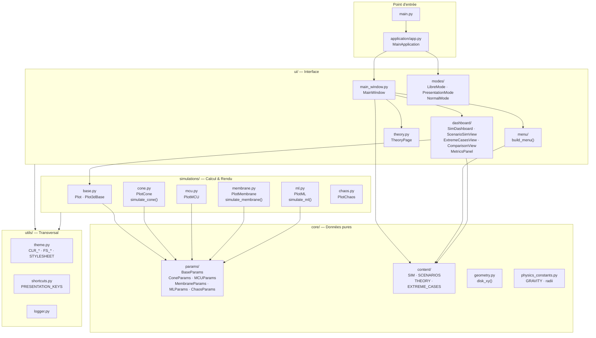
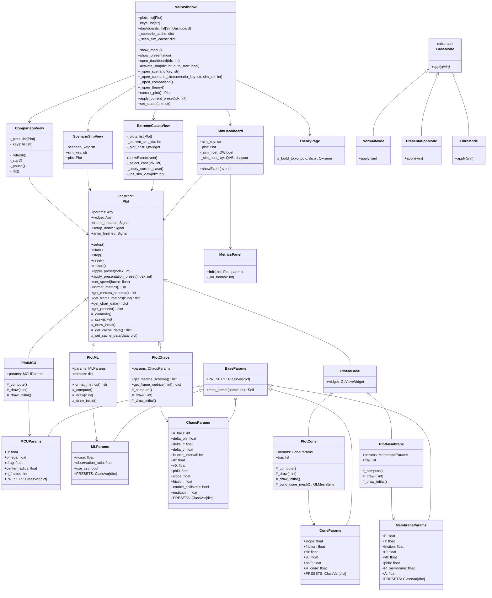
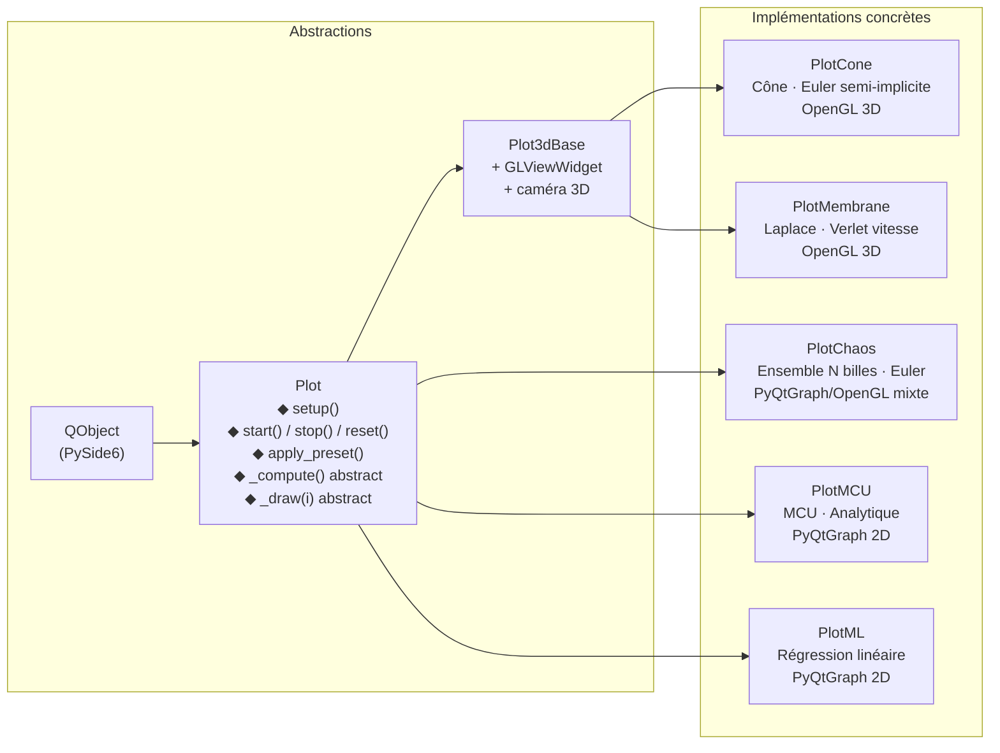
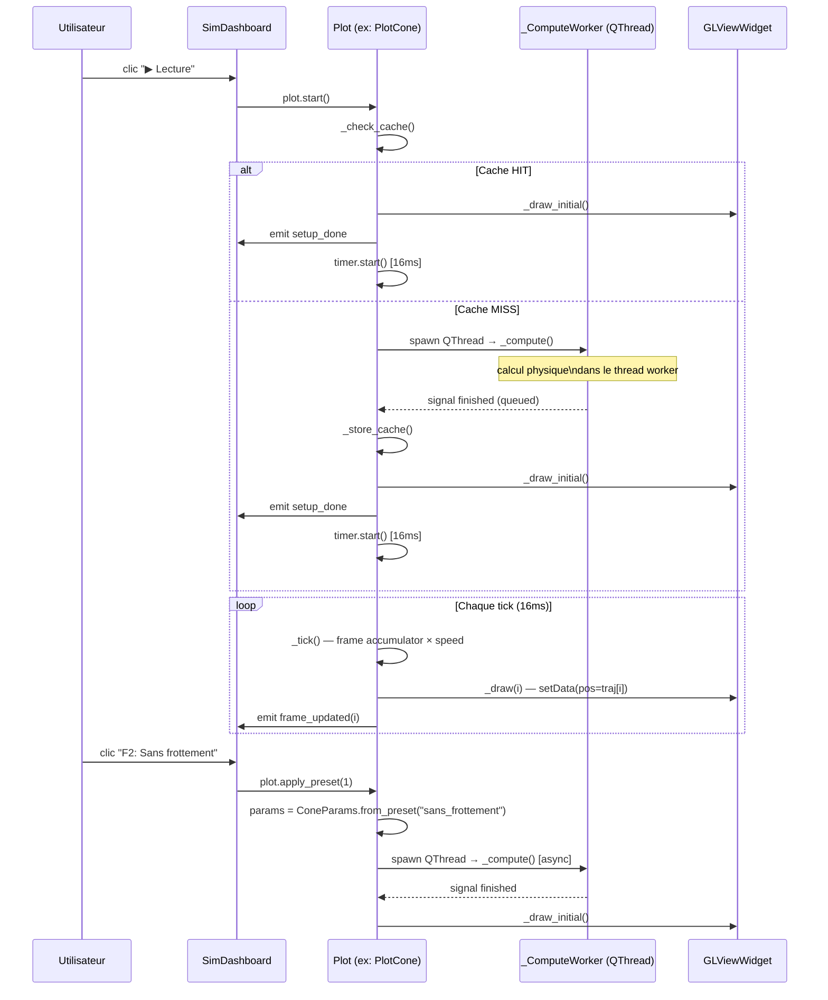
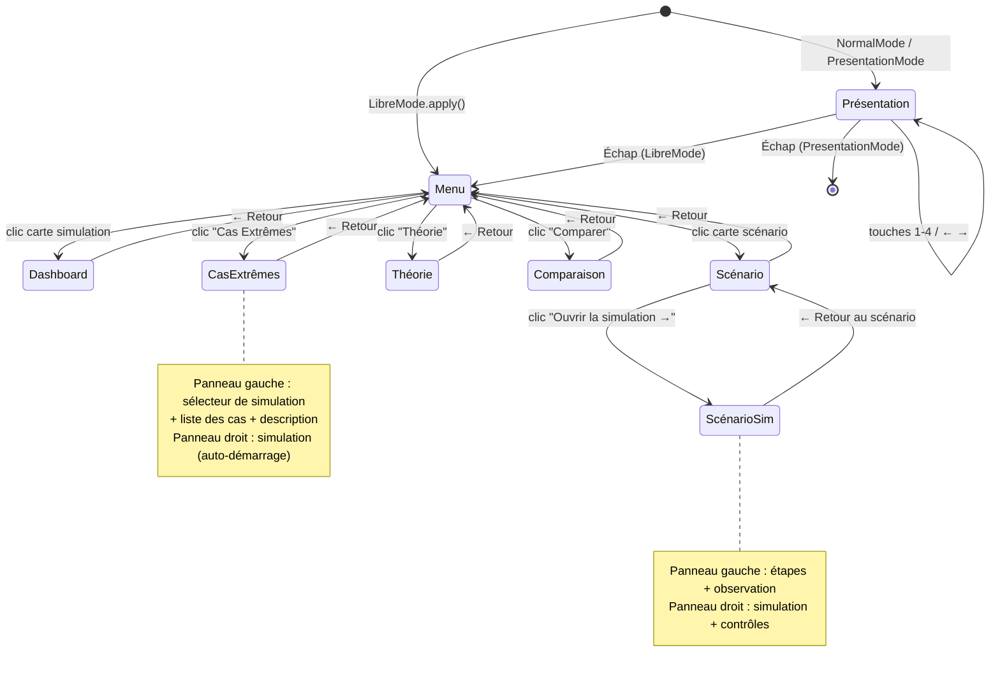
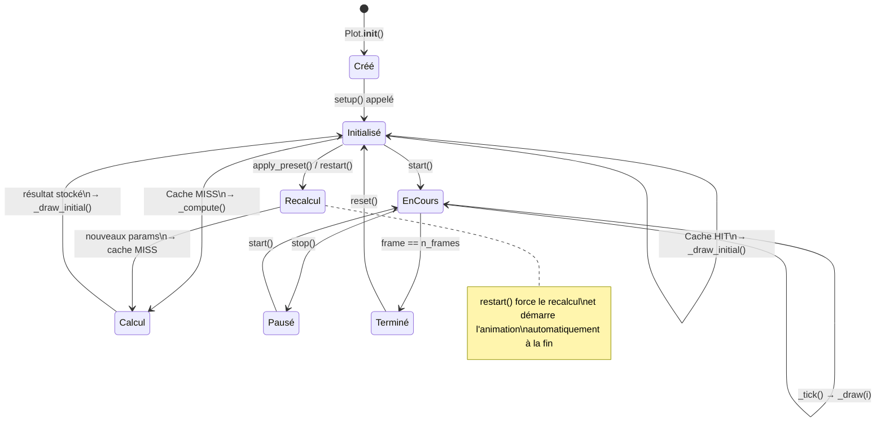
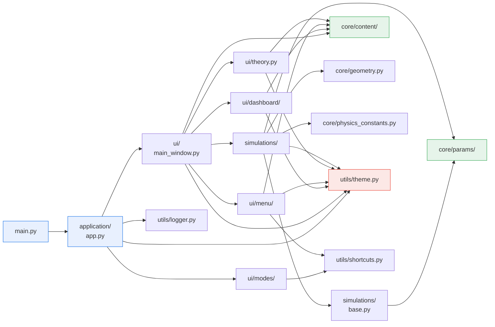
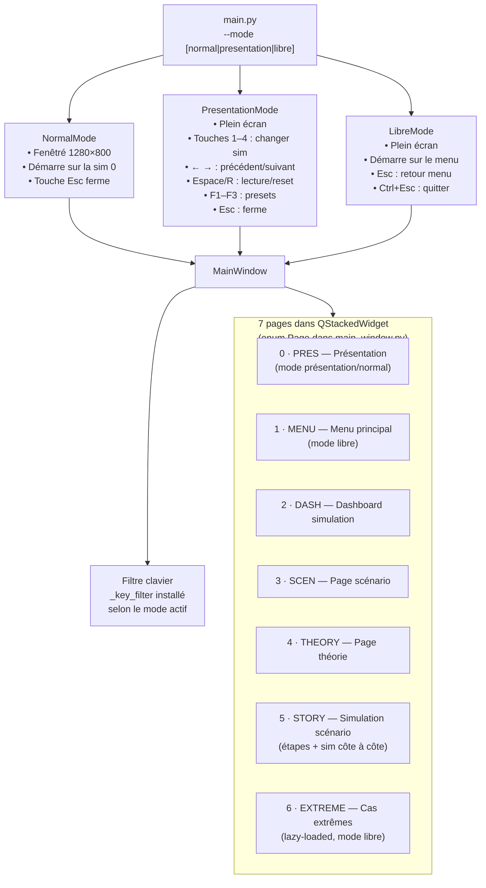

# Architecture — Simulation Trajectoire

> Diagrammes de l'architecture du projet au format Mermaid.

---

## Table des matières

1. [Vue d'ensemble des couches](#1-vue-densemble-des-couches)
2. [Diagramme de classes complet](#2-diagramme-de-classes-complet)
3. [Hiérarchie des simulations](#3-hiérarchie-des-simulations)
4. [Flux de données : params → physique → rendu → UI](#4-flux-de-données--params--physique--rendu--ui)
5. [Navigation entre les pages](#5-navigation-entre-les-pages)
6. [Cycle de vie d'une animation](#6-cycle-de-vie-dune-animation)
7. [Dépendances inter-modules](#7-dépendances-inter-modules)
8. [Modes d'application](#8-modes-dapplication)

---

## 1. Vue d'ensemble des couches

---

## 2. Diagramme de classes complet

---

## 3. Hiérarchie des simulations

---

## 4. Flux de données : params → physique → rendu → UI

---

## 5. Navigation entre les pages

---

## 6. Cycle de vie d'une animation

---

## 7. Dépendances inter-modules

> Aucune dépendance circulaire. Les couches `core/` ne dépendent d'aucune couche supérieure.

---

## 8. Modes d'application

